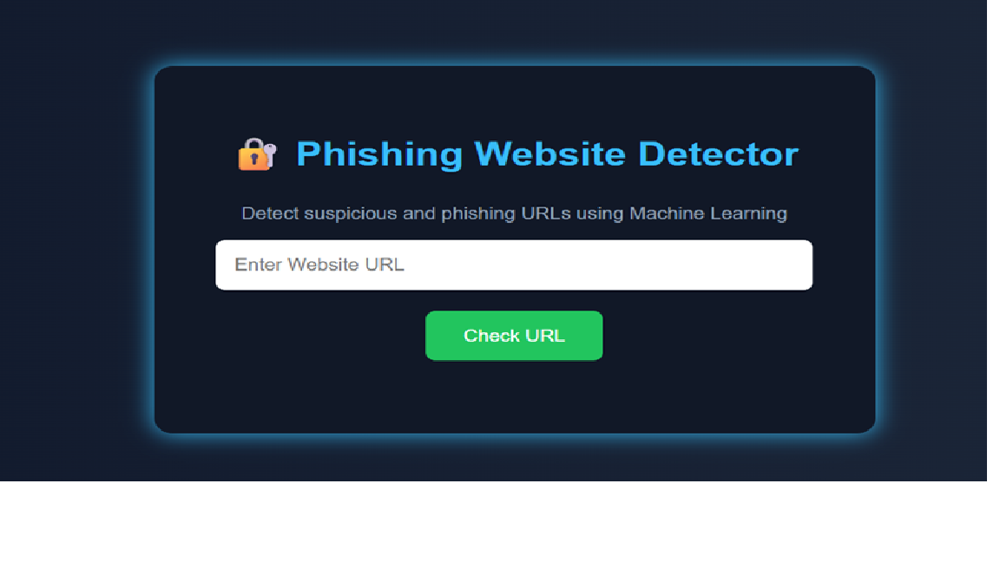

# Phishing Website Detector

This project detects phishing websites using Machine Learning and Flask.

## Features
- URL analysis
- Machine Learning prediction
- Cybersecurity project
- Flask web application

## Technologies Used
- Python
- Flask
- Scikit-learn
- HTML/CSS

## How It Works
1. User enters a URL
2. Features are extracted
3. Machine learning model predicts:
   - Safe Website
   - Phishing Website

## Author
Hema sri b

## Screenshots

### Home Page

### Result Page

